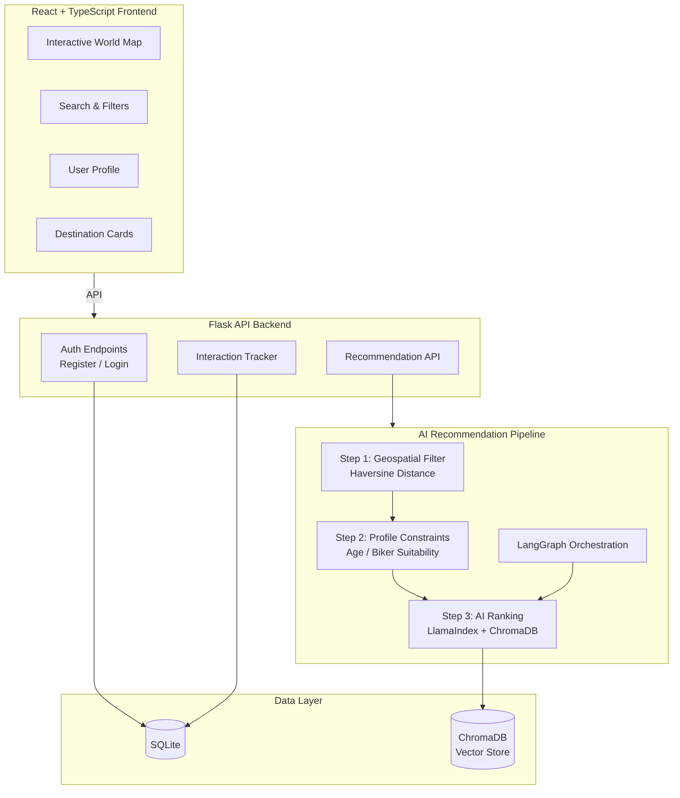
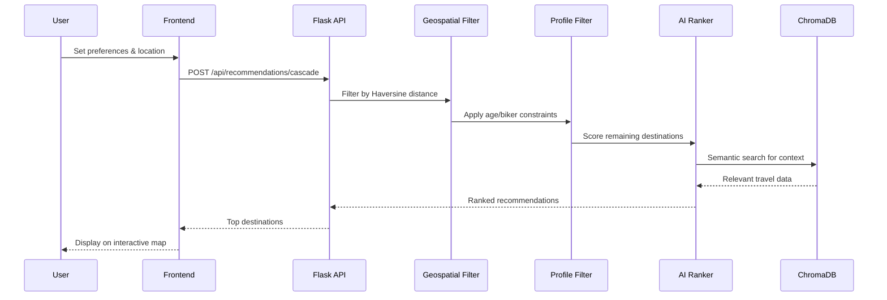

# wanderlust 🌍✈️

[](https://github.com/krishnakumarbhat/wanderlust/actions/workflows/ci.yml)
[](https://www.typescriptlang.org/)
[](https://flask.palletsprojects.com/)

A **travel bucket-list and recommendation** platform — discover destinations, share experiences, and get AI-powered travel recommendations. Features an interactive world map, geospatial filtering, and personalized suggestions.

## 🏗️ Architecture



## 🔄 Recommendation Flow



## 🚀 Features

- **Interactive World Map** — Explore destinations visually
- **AI Recommendations** — Personalized suggestions using LangGraph + LlamaIndex + ChromaDB
- **Geospatial Filtering** — Distance-based filtering with Haversine formula
- **Profile Matching** — Age and activity suitability constraints
- **Social Features** — See what other travelers explored
- **Auth System** — JWT-based authentication

## 🛠️ Tech Stack

| Layer       | Technology                                |
| ----------- | ----------------------------------------- |
| Frontend    | React, TypeScript, Vite, Gemini AI Studio |
| Backend     | Flask, Python 3.10+                       |
| AI Pipeline | LangGraph, LlamaIndex, ChromaDB           |
| Auth        | SQLite + JWT                              |
| Geospatial  | Haversine distance calculation            |

## 📦 Setup

### Frontend

```bash
npm install
# Set GEMINI_API_KEY in .env.local
npm run dev
```

### Backend

```bash
pip install -r backend/requirements.txt
python backend/app.py
```

- Frontend: `http://localhost:3000`
- Backend: `http://localhost:5001`

### Key API Endpoints

| Method | Endpoint                       | Description                    |
| ------ | ------------------------------ | ------------------------------ |
| GET    | `/api/health`                  | Health check                   |
| POST   | `/api/auth/register`           | Register user                  |
| POST   | `/api/auth/login`              | Login                          |
| POST   | `/api/recommendations/cascade` | AI recommendations (auth)      |
| POST   | `/api/recommendations/demo`    | Demo recommendations (no auth) |
| POST   | `/api/interactions`            | Log user interaction (auth)    |

## 📁 Project Structure

```
wanderlust/
├── App.tsx                # React root component
├── components/            # React UI components
├── services/              # API service layer
├── types.ts               # TypeScript types
├── index.html
├── vite.config.ts
├── backend/
│   ├── app.py             # Flask server
│   ├── requirements.txt
│   └── ...
├── .github/workflows/     # CI/CD pipeline
├── .gitignore
└── README.md
```

## 📝 License

MIT License

## 🤝 Contributing

1. Fork the repository
2. Create a feature branch: `git checkout -b feature-name`
3. Commit your changes: `git commit -m 'Add feature'`
4. Push to the branch: `git push origin feature-name`
5. Open a pull request
