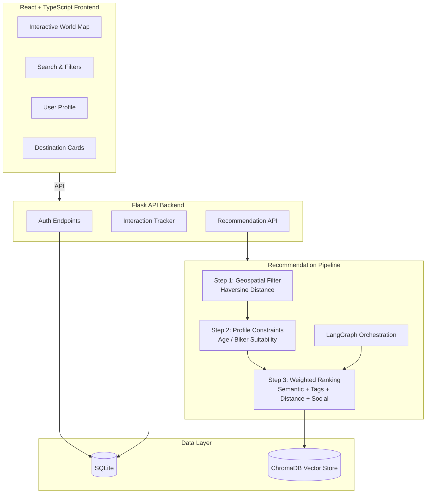

# wanderlust 🌍✈️

[](https://github.com/krishnakumarbhat/wanderlust/actions/workflows/ci.yml)
[](LICENSE)
[](https://www.typescriptlang.org/)
[](CONTRIBUTING.md)
[](https://github.com/prettier/prettier)

> A travel bucket-list and AI recommendation platform — pin destinations on an interactive world map and get personalized suggestions from a hybrid recommender (geospatial + profile + semantic ranking).

<!-- AGENT INSTRUCTION: Add a demo GIF here before launch: docs/demo.gif -->
<!--  -->

## Why wanderlust?

Most bucket-list apps are static lists. wanderlust puts your travels on a **live world map** and recommends your next destination with a transparent, explainable scoring pipeline — you can see *why* every place was recommended (`semantic / tag_match / distance / social` scores ship with every result).

## ✨ Features

- 🗺️ **Interactive world map** — click anywhere to add a place (Leaflet)
- 🤖 **Hybrid AI recommender** — Haversine geo-filter → profile constraints → semantic ranking (embeddings + ChromaDB) → weighted scoring, orchestrated by LangGraph
- 🔍 **Explainable scores** — every recommendation includes its score breakdown
- 👤 **Auth** — register/login, per-user visited & saved interactions feed back into recommendations
- 🧪 **Tested** — pytest suite covering the full pipeline

## 🏗️ Architecture


```mermaid
flowchart TD
    subgraph Frontend["React + TypeScript Frontend"]
        MAP[Interactive World Map]
        SEARCH[Search & Filters]
        PROFILE[User Profile]
        CARDS[Destination Cards]
    end

    subgraph Backend["Flask API Backend"]
        AUTH_API[Auth Endpoints]
        REC_API[Recommendation API]
        INT_API[Interaction Tracker]
    end

    subgraph Pipeline["Recommendation Pipeline"]
        GEO[Step 1: Geospatial Filter<br/>Haversine Distance]
        PROF[Step 2: Profile Constraints<br/>Age / Biker Suitability]
        AI_RANK[Step 3: Weighted Ranking<br/>Semantic + Tags + Distance + Social]
        GRAPH[LangGraph Orchestration]
    end

    subgraph Data["Data Layer"]
        DB[(SQLite)]
        CHROMA[(ChromaDB Vector Store)]
    end

    Frontend -->|API| Backend
    REC_API --> Pipeline
    GEO --> PROF --> AI_RANK
    AI_RANK --> CHROMA
    GRAPH --> AI_RANK
    AUTH_API --> DB
    INT_API --> DB
```

### How a recommendation is scored

```
final_score = 0.45 · semantic_similarity   (bge-small embeddings vs your loved/saved tags)
            + 0.30 · tag_overlap           (Jaccard-style match with your history)
            + 0.15 · proximity             (1 − distance/1500 km)
            + 0.10 · social_signal         (how much other users loved it)
```

## 🚀 Quick Start

### One command (Docker)

```bash
docker compose up --build
# Frontend: http://localhost:3000 · Backend: http://localhost:5001
```

### Manual setup

**Backend** (Python 3.10+):

```bash
pip install -r backend/requirements.txt
cp backend/.env.example backend/.env   # set WANDERLUST_SECRET_KEY
python backend/app.py                  # http://localhost:5001
```

**Frontend** (Node 18+):

```bash
npm install
npm run dev                            # http://localhost:3000
```

On first boot the backend embeds `backend/data/places.json` into ChromaDB (downloads the `BAAI/bge-small-en-v1.5` model once).

## 🔌 API Reference

| Method | Endpoint | Description | Auth |
| ------ | -------- | ----------- | ---- |
| GET    | `/api/health` | Health check | – |
| POST   | `/api/auth/register` | Register user | – |
| POST   | `/api/auth/login` | Login, returns token | – |
| POST   | `/api/recommendations/cascade` | Personalized recommendations | Bearer |
| POST   | `/api/recommendations/demo` | Recommendations without account | – |
| POST   | `/api/interactions` | Log `saved` / `loved` interaction | Bearer |

## 📁 Project Structure

```
wanderlust/
├── App.tsx                # React root component
├── components/            # UI components (map, sidebar, modals)
├── services/              # API client layer
├── types.ts               # Shared TypeScript types
├── backend/
│   ├── app.py             # Flask server + auth
│   ├── recommender.py     # Recommendation pipeline (all algorithms)
│   ├── db.py              # SQLite helpers
│   └── data/places.json   # Destination dataset
├── tests/                 # Pytest suite for the pipeline
├── docs/                  # Architecture diagrams (draw.io)
└── .github/workflows/     # CI (lint + typecheck + tests)
```

## 🗺️ Roadmap

| Feature | Status |
| ------- | ------ |
| Trip sharing links (`/trip/:id`) | planned · `good first issue` |
| Comments & likes on places | planned |
| Multi-day itineraries with route lines | planned |
| Leaderboards & achievement badges | planned |
| Dark mode + motion polish | planned |

Want to claim one? Check [CONTRIBUTING.md](CONTRIBUTING.md).

## 🤝 Contributing

Contributions are what make open source great! Read [CONTRIBUTING.md](CONTRIBUTING.md) to get started. First-timers: look for issues labeled `good first issue`.

## 📄 License

Distributed under the MIT License. See [`LICENSE`](LICENSE).
