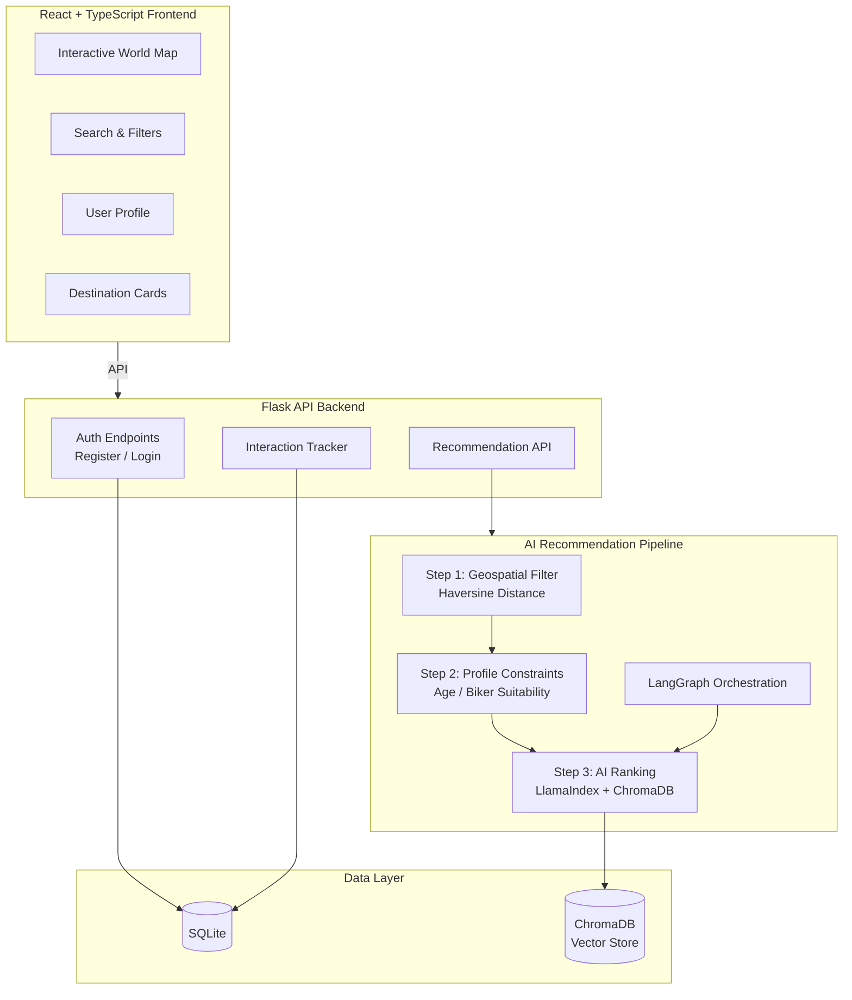
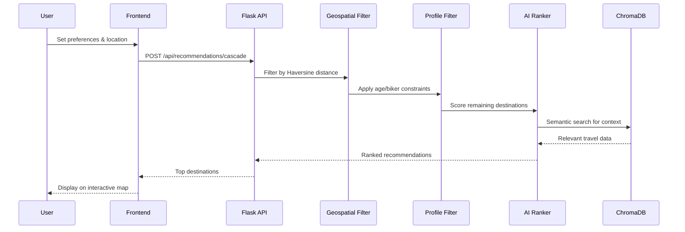

# wanderlust 🌍✈️

[](https://github.com/krishnakumarbhat/wanderlust/actions/workflows/ci.yml)
[](https://www.typescriptlang.org/)
[](https://flask.palletsprojects.com/)

A **travel bucket-list and recommendation** platform — discover destinations, share experiences, and get AI-powered travel recommendations. Features an interactive world map, geospatial filtering, and personalized suggestions.

## 🏗️ Architecture



## 🔄 Recommendation Flow



## 🚀 Features

- **Interactive World Map** — Explore destinations visually
- **AI Recommendations** — Personalized suggestions using LangGraph + LlamaIndex + ChromaDB
- **Geospatial Filtering** — Distance-based filtering with Haversine formula
- **Profile Matching** — Age and activity suitability constraints
- **Social Features** — See what other travelers explored
- **Auth System** — JWT-based authentication

## 🛠️ Tech Stack

| Layer       | Technology                                |
| ----------- | ----------------------------------------- |
| Frontend    | React, TypeScript, Vite, Gemini AI Studio |
| Backend     | Flask, Python 3.10+                       |
| AI Pipeline | LangGraph, LlamaIndex, ChromaDB           |
| Auth        | SQLite + JWT                              |
| Geospatial  | Haversine distance calculation            |

## 📦 Setup

### Frontend

```bash
npm install
# Set GEMINI_API_KEY in .env.local
npm run dev
```

### Backend

```bash
pip install -r backend/requirements.txt
python backend/app.py
```

- Frontend: `http://localhost:3000`
- Backend: `http://localhost:5001`

### Key API Endpoints

| Method | Endpoint                       | Description                    |
| ------ | ------------------------------ | ------------------------------ |
| GET    | `/api/health`                  | Health check                   |
| POST   | `/api/auth/register`           | Register user                  |
| POST   | `/api/auth/login`              | Login                          |
| POST   | `/api/recommendations/cascade` | AI recommendations (auth)      |
| POST   | `/api/recommendations/demo`    | Demo recommendations (no auth) |
| POST   | `/api/interactions`            | Log user interaction (auth)    |

## 📁 Project Structure

```
wanderlust/
├── App.tsx                # React root component
├── components/            # React UI components
├── services/              # API service layer
├── types.ts               # TypeScript types
├── index.html
├── vite.config.ts
├── backend/
│   ├── app.py             # Flask server
│   ├── requirements.txt
│   └── ...
├── .github/workflows/     # CI/CD pipeline
├── .gitignore
└── README.md
```

## 📝 License

MIT License

## 🤝 Contributing

1. Fork the repository
2. Create a feature branch: `git checkout -b feature-name`
3. Commit your changes: `git commit -m 'Add feature'`
4. Push to the branch: `git push origin feature-name`
5. Open a pull request
Constraint-Based / Knowledge-Based Filtering
Before using complex AI, you can use rules based on the user's explicit profile constraints. This is highly effective for travel because physical logistics matter.

How it works for Wanderlust: It filters destinations using hard rules. If a user is based in "Bengaluru" and indicates they are a "biker," the system calculates the radius (e.g., within 500km) and filters for places tagged "motorcycle-friendly" or "scenic highways."

Algorithms to use: * Geospatial Queries (Haversine Formula): To calculate the distance between where they stay and the destination.

Rule-Based Engines: Simple IF/THEN logic to filter out inappropriate places (e.g., filtering out intense high-altitude treks for elderly users unless they specifically requested them).

2. Content-Based Filtering (Tag Matching)
This focuses on the attributes of the places the user has loved in the past.

How it works for Wanderlust: You tag every place in your database (e.g., Goa = [beach, party, humid], Ladakh = [mountain, cold, biker-paradise]). If a user saves Ladakh and Spiti Valley, the system builds a profile for them favoring [mountain, biker-paradise] and suggests similar places like Tawang.

Algorithms to use:

Cosine Similarity: Compares the mathematical "distance" between the user's preferred tags and the tags of unvisited places.

K-Nearest Neighbors (KNN): Finds the top 'K' destinations that most closely resemble the places the user already loved.

3. Collaborative Filtering (User Similarity)
This relies on the community of users on your app.

How it works for Wanderlust: The system ignores the tags of the places entirely. Instead, it looks at behavior: "Users who rode their bikes to Ooty and liked it, also rode to Coorg and liked it."

Algorithms to use:

Matrix Factorization (SVD): Creates a matrix of Users vs. Places. It fills in the blanks to predict how much a user would rate a place they haven't been to yet, based on similar travelers.

4. Context-Aware Recommendation Systems (CARS) - The Best Fit
Standard collaborative filtering struggles when you add extra context like "Age" or "Where they stay." Context-Aware systems are designed exactly for this.

How it works for Wanderlust: It takes the core recommendation (User A might like Place B) and adjusts it based on the context (User A is a biker, 25 years old, and it's currently monsoon season).

Algorithms to use:

Factorization Machines (FM): This is highly recommended for your project. It is brilliant at handling sparse, varied data (combining User ID, Place ID, Age, Travel Style, and Distance into one predictive model).

Gradient Boosting Machines (XGBoost / LightGBM): You can frame this as a classification problem. You feed the algorithm tabular data (User Age, User City, Place City, Distance, Place Tags) and it predicts the probability (0 to 100%) that the user will love that place.

5. Graph-Based Recommendations
Travel data is incredibly relational (User -> lives in -> City -> connected by highway to -> Destination).

How it works for Wanderlust: You store your data as a web. When a user asks for a recommendation, the algorithm "walks" the graph to find nodes (places) closely connected to their interests and past visits.

Algorithms to use:

Graph Neural Networks (GNNs) or using a graph database like Neo4j to run pathfinding algorithms (like PageRank) to find trending destinations within a specific sub-community (e.g., the biker community).